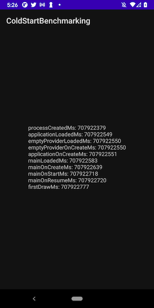

# ColdStartBenchmarking
A repository to demonstrate how coldstart can be benchmarked.

## Content

The project is based on the awesome work of @pyricau to benchamrk the cold start of the Application.
Read the [blog](https://dev.to/pyricau/series/7827) to see the deatils.

Note: The app currently does not differentiate between cold start and other starts.

## Demo

The following screenshot is a sample run of this Skeloton Applicaiton. (Android 10, Pixel 3)

